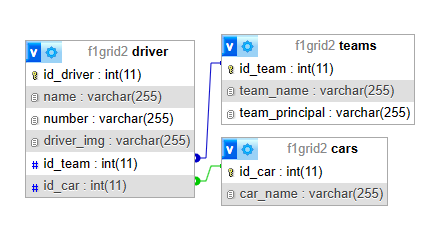

# TP3DPBO2023

## Janji
Saya Rifqi Fajar Indrayadi dengan NIM 2101103 mengerjakan Tugas Praktikum 3 DPBO dalam mata kuliah Desain Pemrograman Berorientasi Objek untuk keberkahan-Nya maka saya tidak melakukan kecurangan seperti yang telah dispesifikasikan. Aamiin.

## Desain Database

## Alur Program
1. Pada halaman utama terdapat list driver dengan data driver masing-masing seperti foto, nama, tim, nomor, dan kode chassis mobil nya. User dapat melakukan sorting data driver berdasarkan number nya dengan descending atau ascending. Selain itu user juga dapat melakukan pencarian nama driver dengan mengetikkan nama nya di kolom search
2. Ketika kotak driver ditekan maka akan tampil detail dari driver tersebut lalu user bisa mengubah atau menghapus data driver
3. Untuk menambah driver, user bisa menekan tombol 'Add Driver' pada navbar dan akan ditampilkan form untuk mengisi data driver
4. Untuk melihat list Team yang ada bisa menekan tombol 'Team List' pada navbar, akan ada form di bagian atas untuk menambah Team baru, user juga bisa mengubah atau menghapus data team dengan menekan button yang ada di kolom 'Action' ketika user menekan edit maka data team akan ditampilkan di form yang ada di bagian atas sehingga user bisa mengubah data nya
5. Hal yang sama untuk data mobil, perbedaan nya hanya pada jumlah kolom tabel sehingga text field pada form nya pun berbeda

## Dokumentasi Program
